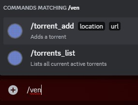
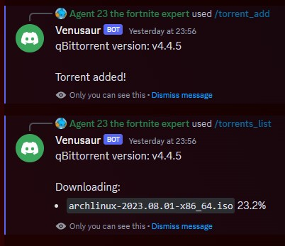

# mini-qbittorrent-discord-bot

Small discord bot to list current active torrents and add new torrents in predetermined locations. Adding torrents is owner only.

### Environment variables

|Environment variable|Default|Description|
|---|---|---|
BOT_TOKEN|(None)|Required. The discord bot token.
QBIT_HOST|localhost|The host qbittorrent's web server runs on.
QBIT_PORT|8080|The port qbittorrent's web server runs on.
QBIT_USER|admin|The user to log in with on qbittorrent.
QBIT_PASS|adminadmin|The password to log in with on qbittorrent.
FOLDER_(folder_name)|None|At least 1 location is required. See below for how to set this up.

### Folder names
Each environment variable starting with `FOLDER_` will be seen as a path to store torrents in. For example:
- `FOLDER_Movies=~/Movies`
- `FOLDER_Shows=~/Shows`

This will give 2 options in discord: Shows and Movies. Selecting Shows will download to `~/Shows`.
